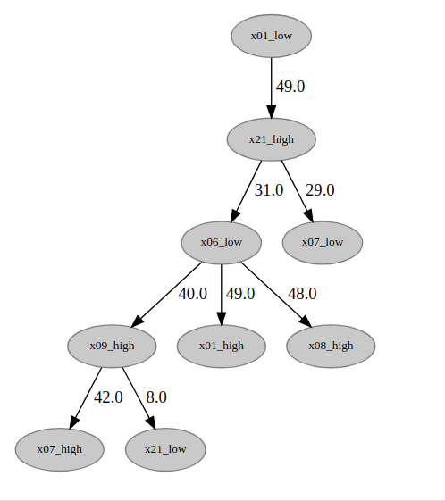

# Detection of Causal Relationships between time series
Code for paper "A method for detecting causal relationships between discrete time series using Transfer entropy and K2-Algorithm: A case study on the plant-wide simulation Tennessee Eastman Process"

## About

This repository provides all the codes for the implementation of the method of detection of causality between time series, using a modified version of the K2-Algorithm and Transfer Entropy. It also provides a notebook and script (Methodology.ipynb) where the case study, described in the paper, using the simulated chemical process Tennesee Eastman can be reproduced by the use of function "apply_methodology"

## Content

* Data - Folder containing the following datasets, that can be used to reproduce the results of the paper.
  * alarms_m5.csv  - The dataset of industrial alarms used in the case study
  * df_te.csv - Dataset with entropies already computed for the study case
  * df_lag.csv - Dataset with the lags computed in the transfer entropy - corresponds to the 'h' parameter that produced the high amount of entropy
  
*K2_utils.py - Python script with K2-algorithm basic functions implemented
*TransferEntropy_utils.py Python script with Transfer Entropy basic functions implemented
*Utils.py - Python script with basic functions used in the proposed method
*Methodology.py - Python script containing the implementation of all the algorithms needed to use the proposed method, along with the function "apply_methodology" which does reproduce all the stages of the method and reproduces the result presented on the paper.
*Methodology.ipynb - Jupyter notebook of the Methodology script, it can be used for study purposes. 

## Final Graph of causal relationships produced by the application of the method

## How to reproduce the results and test with other datasets

### To reproduce the result of the paper
  By using the function "apply_methodology" present in the Methodology.ipynb  or in the script Methodology.py, the given datasets and the setting proposed in the paper,  you can reproduce the result. Note that these settings are already specified in the notebook and in the script.

### To run with other datasets

  You can use the *apply_methodology* function, using the desired dataset and desired settings (l, k, h, t). 

